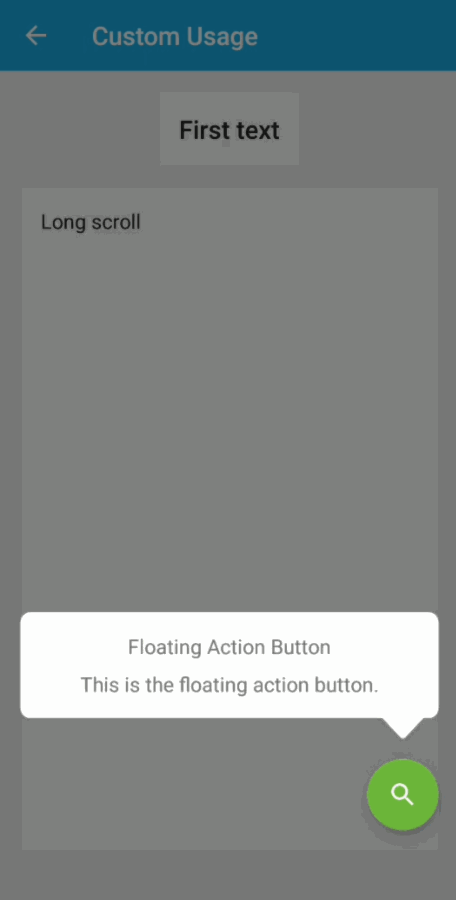
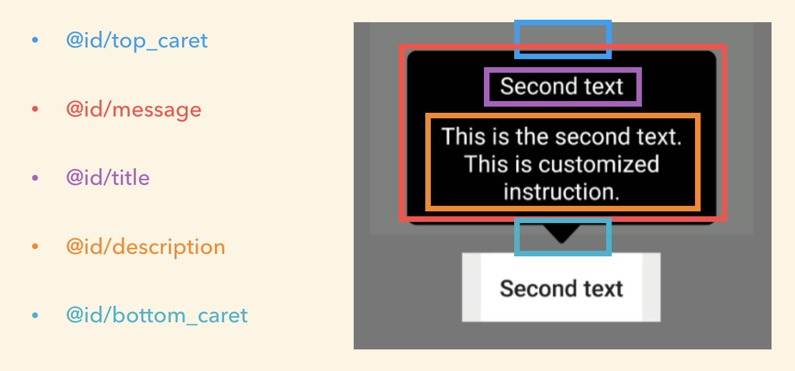

# Android Target Instructions

[](https://jitpack.io/#Kyash/android-target-instructions)

Make easy to implement the instructions feature to your app.



# Download

## Project build.gradle

```groovy
allprojects {
    repositories {
        ...
        maven { url "https://jitpack.io" }
    }
}
```

## App build.gradle

```groovy
dependencies {
    ...
    compile 'com.github.Kyash:android-target-instructions:LATEST_VERSION'
}
```

`LATEST_VERSION` is  [](https://jitpack.io/#Kyash/android-target-instructions)

# Simple Usage

Create `Target` instance to set view.

```kotlin
// Create Target and set
val target1 = SimpleTarget.Builder(context)
  .setTarget(binding.fab)
  .setTitle("Floating Action Button")
  .setHighlightRadius(100f) // Circle shape
  .setDescription("This is the floating action button.")
  .build()

val target2 = SimpleTarget.Builder(context)
  .setTarget(binding.firstText)
  .setTitle("First text")
  .setDescription("This is the first text.")
  .setHighlightPadding(R.dimen.simple_highlight_padding)
  .build()
```

Then, set them to `TargetInstructions` and call `start()` method.

```kotlin
TargetInstructions.with(activity)
  .setTargets(arrayListOf(target1, target2))
  .start()
```

That's it!

# Advanced Usage

## SimpleTarget attributes

You can set some attributes to `SimpleTarget` class.

```kotlin
val target = SimpleTarget.Builder(context)
  .setTarget(binding.fab)
  // or you can set target by using left, top position and width, height.
  .setTarget(0f, 0f, 100f, 100f)
  .setTitle("Floating Action Button")
  .setDescription("This is the floating action button.")
  .setHighlightRadius(100f) // If you don't set this, the highlight shape would be square.
  .setMessageInterpolator(FastOutSlowInInterpolator()) // For message scale animation
  .setMessageAnimationDuration(200L)
  .setPositionType(Target.Position.ABOVE) // Message position
  .setStartDelayMillis(200L)
  .setListener(object: Target.OnStateChangedListener {
    override fun onClosed() {
      // Do after target is closed. Ex) Scroll to bottom
    }
  })
  .build()
```

## Customize SimpleTarget Layout

You can set the custom layout file to `SimpleTarget` like [this](https://github.com/Kyash/android-target-instructions/blob/3374e0528ed352c05b7827a158f717f6e1c48a1c/example/src/main/java/co/kyash/androidtargetinstructions/example/CustomUsageActivity.kt#L68).

```kotlin
SimpleTarget.Builder(context).setTarget(binding.secondText)
  .setTitle("Second text")
  .setDescription("This is the second text. This is customized instruction.")
  .setMessageLayoutResId(R.layout.layout_instruction_simple_message_black) // This is custom layout
```

This custom layout code is [here](https://github.com/Kyash/android-target-instructions/blob/3374e0528ed352c05b7827a158f717f6e1c48a1c/example/src/main/res/layout/layout_instruction_simple_message_black.xml).

You have to put these layout id in custom layout.



## Create custom Target
If you want to customize more, you can create the original `Target` class by implementing `co.kyash.targetinstructions.targets.Target` class.

[SimpleTarget.kt](https://github.com/Kyash/android-target-instructions/blob/master/library/src/main/java/co/kyash/targetinstructions/targets/SimpleTarget.kt) would help you.

## TargetInstructions attributes

You can set some attributes to `TargetInstructions` class.

```kotlin
TargetInstructions.with(this@SimpleUsageActivity)
  .setTargets(arrayListOf(target1, target2))
  .setFadeDuration(200L)
  .setFadeInterpolator(LinearOutSlowInInterpolator())
  .setOverlayColorResId(R.color.black_alpha) // Background color
  .start()
  // .finish() // Call this method when you want to finish tutorial.
```

# Dependencies
This library depends on Kotlin.

# Thanks
This library is inspired from these awesome code. Thank you so much!
- https://github.com/TakuSemba/Spotlight
- https://github.com/itzikBraun/TutorialView
- https://github.com/sjwall/MaterialTapTargetPrompt

# Contributing
We are always welcome your contribution!
If you find a bug or want to add new feature, please raise issue.

# License

```
Copyright 2018 Kyash

Licensed under the Apache License, Version 2.0 (the "License");
you may not use this file except in compliance with the License.
You may obtain a copy of the License at

    http://www.apache.org/licenses/LICENSE-2.0

Unless required by applicable law or agreed to in writing, software
distributed under the License is distributed on an "AS IS" BASIS,
WITHOUT WARRANTIES OR CONDITIONS OF ANY KIND, either express or implied.
See the License for the specific language governing permissions and
limitations under the License.
```